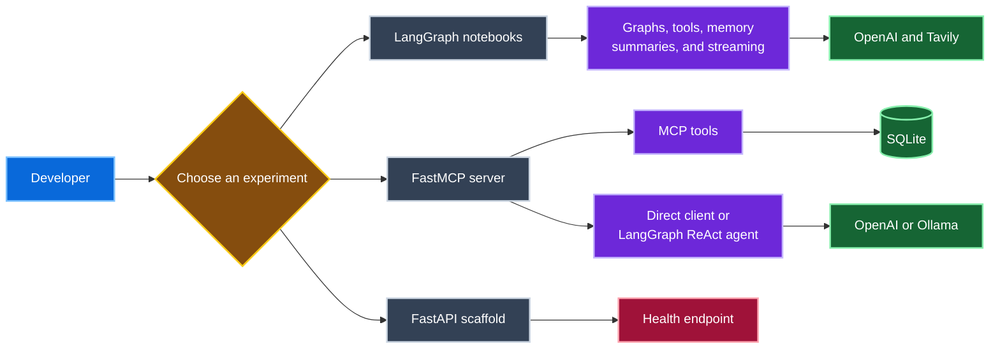

# MCP & Agent Engineering Playground

Hands-on exploration of the Model Context Protocol (MCP), LangGraph agents, and structured LLM application patterns.

This repository collects small, focused experiments rather than one production application. The most complete example is a local FastMCP server whose tools read and write an embedded SQLite database and can be called directly or through a LangGraph ReAct agent.

## What's inside

| Project | What it demonstrates | Status |
| --- | --- | --- |
| [`local_mcp_engine`](local_mcp_engine/) | FastMCP tools, streamable HTTP, SQLite persistence, direct client calls, and a LangGraph agent using OpenAI or Ollama | Working prototype |
| [`langgraph_playground`](langgraph_playground/) | Graph state, routing, tool use, memory, message reduction, summarization, and streaming across 12 notebooks | Learning notebooks |
| [`structured_gen`](structured_gen/) | FastAPI foundation for a future structured-output service | Early scaffold; health endpoint only |

## Architecture



## Tech stack

- Python 3.12 and [uv](https://docs.astral.sh/uv/)
- FastMCP and the Model Context Protocol
- LangGraph and LangChain
- OpenAI, Tavily, and optional local Ollama models
- FastAPI, Uvicorn, and SQLite
- Jupyter notebooks

## Quick start

### Local MCP engine

The server exposes four tools: `greet`, `add_person`, `list_people`, and `remove_person`.

```bash
git clone https://github.com/that-rookie-parth/mcp_explore.git
cd mcp_explore/local_mcp_engine
uv sync --frozen
uv run uvicorn server:app --reload --no-access-log
```

With the server running, call it from a second terminal:

```bash
cd mcp_explore/local_mcp_engine
uv run python client.py
```

For agent-driven tool use, open `client_openai.ipynb`. It is configured for a local Ollama model by default; an OpenAI configuration is included as commented code. Copy `.env.example` to `.env` before using OpenAI, and never commit the populated file.

### LangGraph notebooks

```bash
cd mcp_explore/langgraph_playground
uv sync --frozen
cp .env.example .env
uv run --with jupyterlab jupyter lab
```

Add `OPENAI_API_KEY` to `.env`. The introductory Tavily example also needs `TAVILY_API_KEY`. The notebooks progress from basic model and search calls through graphs, routing, ReAct-style agents, memory, state management, conversation summarization, and streaming.

### Structured-generation scaffold

```bash
cd mcp_explore/structured_gen
uv sync --frozen
uv run uvicorn main:app --reload
curl http://localhost:8000/health
```

The current response is `{"status":"ok"}`. Schema-driven generation, model integration, validation, and retry behavior are planned but not implemented yet.

## Repository structure

```text
mcp_explore/
├── local_mcp_engine/       # FastMCP server, clients, and SQLite layer
├── langgraph_playground/   # Progressive LangGraph notebooks
└── structured_gen/         # Minimal FastAPI scaffold
```

## Limitations

- The three projects have separate environments and lockfiles; there is no shared root application.
- Most LangGraph examples call hosted OpenAI models and require user-supplied credentials.
- Ollama compatibility depends on choosing a model that supports tool calls.
- The MCP database is a local SQLite file intended for experimentation, not concurrent production workloads.
- The structured-generation project currently demonstrates API wiring only.

## Acknowledgements

The local MCP experiment was informed by the [AI Engineering Hub MCP examples](https://github.com/patchy631/ai-engineering-hub) and this [ProjectPro MCP overview](https://www.projectpro.io/article/mcp-projects/1142).
